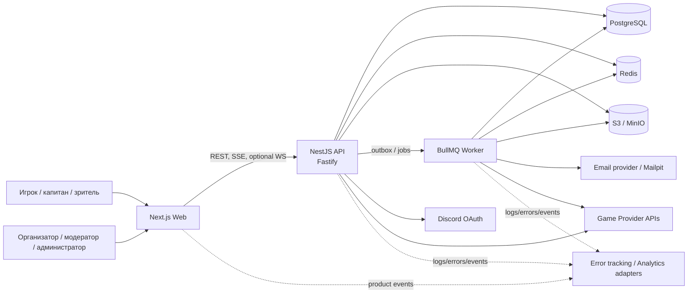
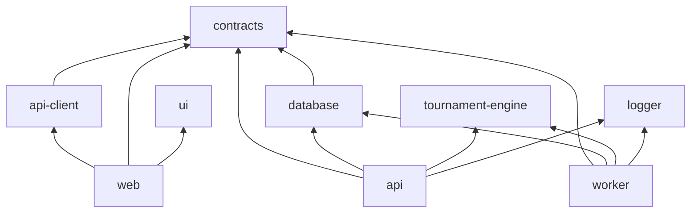
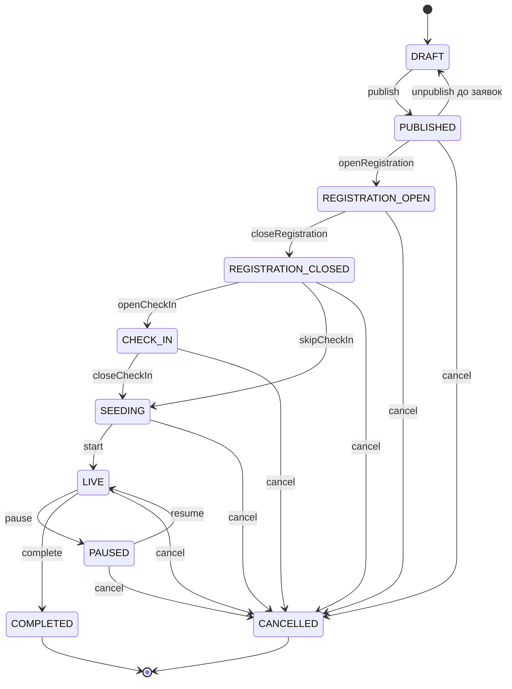
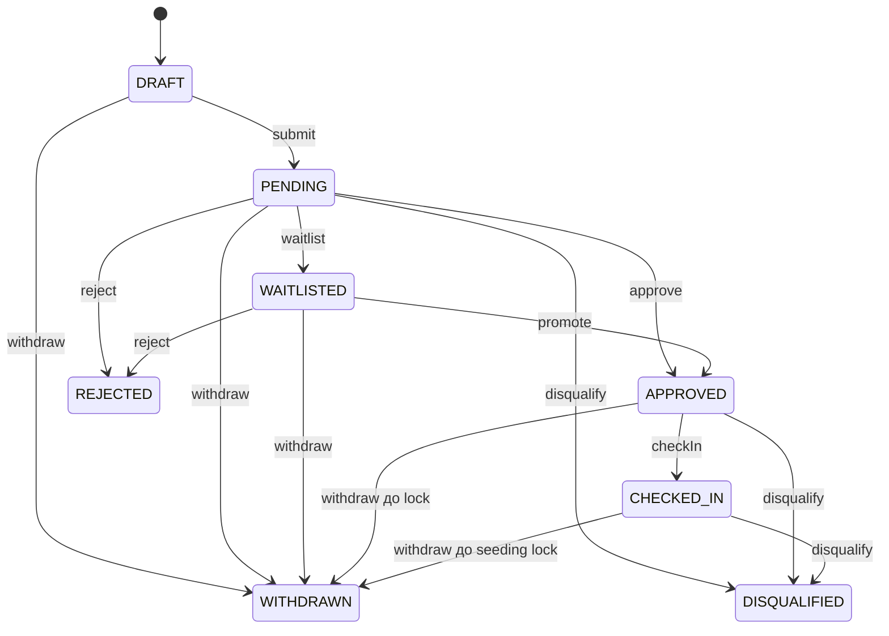
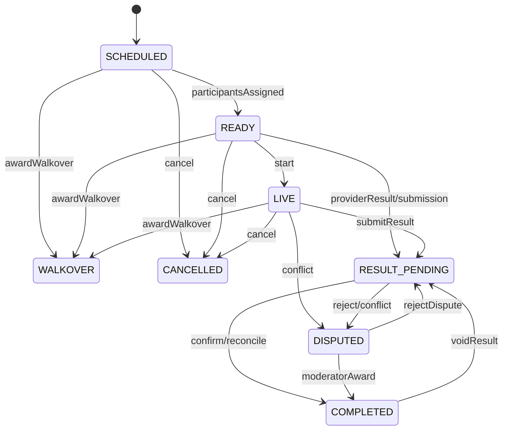
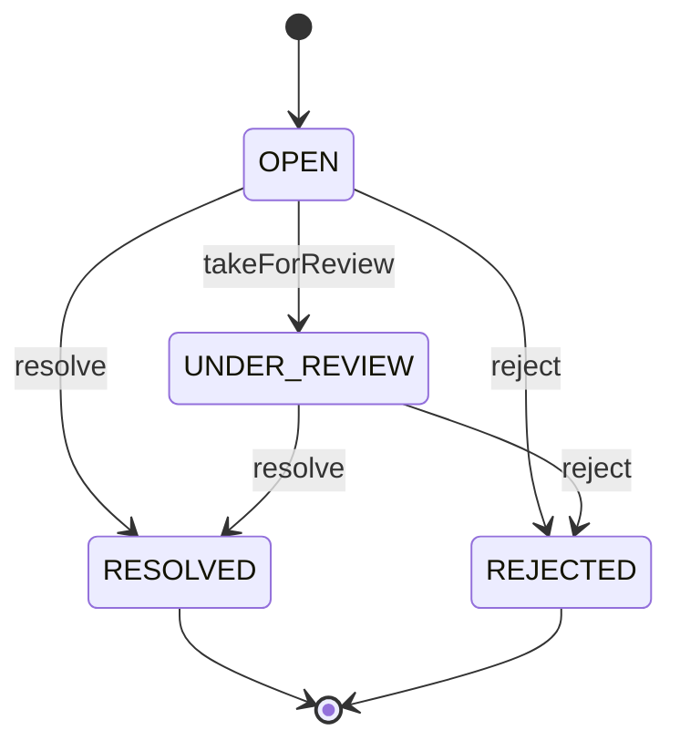

# ARENA GRID — системная и backend-архитектура

Статус: целевая архитектура MVP  
Версия API: `v1`  
Стиль backend: модульный монолит с отдельным worker-процессом  
Основной принцип: клиент отображает состояние, но все права, переходы состояний и турнирные инварианты проверяет API.

## 1. Цели и архитектурные ограничения

ARENA GRID проводит пользователя через полный цикл бесплатного любительского или полупрофессионального турнира: от
поиска и регистрации команды до фиксации результата и продвижения по сетке. MVP должен позволять провести
демонстрационный турнир без ручного изменения базы данных.

Ключевые решения:

- Next.js отвечает за web-интерфейс и SSR, но не содержит бизнес-логику и не является основным API.
- NestJS/Fastify предоставляет versioned REST API, OpenAPI, аутентификацию, авторизацию и оркестрацию транзакций.
- `packages/tournament-engine` — детерминированная чистая TypeScript-библиотека без NestJS, Prisma, сети и часов
  реального времени.
- PostgreSQL — источник истины; Redis используется только для кеша, rate limiting, очередей и доставки realtime-событий.
- BullMQ jobs и внешние callbacks считаются доставляемыми как минимум один раз; все обработчики идемпотентны.
- Состав фиксируется неизменяемым `RosterSnapshot`; после `rosterLockAt` текущий `TeamMember` не меняет состав турнира.
- Все административные изменения результатов, статусов, seed и состава оставляют `AuditEvent`.
- PII минимизируется: email, публичное имя, игровые идентификаторы и технические данные сессии; дата рождения,
  паспортные данные и платежные реквизиты в MVP не хранятся.
- Для несовершеннолетних нет ставок, случайных платных наград, выплат и механик казино.

### 1.1 Нефункциональные ориентиры MVP

| Характеристика  | Ориентир                                                                      |
|-----------------|-------------------------------------------------------------------------------|
| Доступность API | 99.5% в месяц, без учета согласованных работ                                  |
| Latency         | p95 чтения < 400 ms, mutation < 800 ms без внешнего game API                  |
| RPO / RTO       | RPO ≤ 15 минут, RTO ≤ 2 часа                                                  |
| Масштаб         | 10 000 одновременных SSE-подключений, 500 активных турниров                   |
| Аудит           | неизменяемые события для привилегированных действий, хранение не менее 1 года |
| Accessibility   | WCAG 2.2 AA для ключевых пользовательских путей                               |

## 2. Контекст и компоненты системы



### 2.1 Runtime-компоненты

| Компонент           | Ответственность                                                                                                      | Не отвечает за                                      |
|---------------------|----------------------------------------------------------------------------------------------------------------------|-----------------------------------------------------|
| `apps/web`          | App Router, Server Components, формы, TanStack Query, REST/SSE client, optimistic UI только после серверной проверки | права, state machine, прямой доступ к БД            |
| `apps/api`          | REST/OpenAPI, auth/RBAC, application services, транзакции, presigned upload, SSE и при необходимости WS gateway      | длительные задачи, бизнес-правила внутри controller |
| `apps/worker`       | lifecycle timers, email, notifications, provider sync, cleanup, analytics projection, retries/DLQ                    | публичные HTTP mutations                            |
| PostgreSQL          | транзакционный источник истины, outbox, аудит, idempotency records                                                   | ephemeral cache и fan-out соединений                |
| Redis               | BullMQ, rate limits, безопасный кеш provider responses, circuit state, pub/sub или streams                           | каноническое состояние турнира                      |
| S3/MinIO            | evidence, replay, временные загрузки, AV/quarantine metadata                                                         | авторизация на скачивание; доступ выдаёт API        |
| `tournament-engine` | генерация сетки, применение результата, walkover/DQ/void, проверка инвариантов                                       | I/O, ORM, текущая дата, авторизация                 |

### 2.2 Границы доверия и потоки

1. Браузер считается недоверенным. Все идентификаторы владельца, статус и score перепроверяются API.
2. Данные OAuth и game providers считаются внешним вводом и валидируются на границе adapter.
3. Файл загружается по короткоживущему presigned URL в quarantine prefix; `FilesModule` подтверждает размер, MIME,
   checksum и результат malware scan до привязки к evidence.
4. API сначала фиксирует доменную транзакцию и outbox event, затем асинхронно отправляет уведомления и realtime-события.
5. Ошибка Redis не должна приводить к потере канонического изменения: после восстановления outbox публикуется повторно.

## 3. Структура monorepo и зависимости

```text
apps/
  web/                    Next.js frontend
  api/                    NestJS REST API + SSE/WS gateways
  worker/                 BullMQ processors and schedulers
packages/
  contracts/              enums, Zod schemas, shared event contracts
  api-client/             generated OpenAPI client; не редактируется вручную
  database/               Prisma schema, migrations, seed
  ui/                     reusable accessible UI
  config/                 shared TS/ESLint/Prettier/env configuration
  logger/                 Pino configuration and redaction
  tournament-engine/      pure tournament domain engine
```

Разрешённое направление зависимостей:



`tournament-engine` не импортирует ничего из `apps/*` и `database`. `contracts` не импортирует ORM-модели. Prisma
entities не возвращаются из controllers напрямую. OpenAPI генерируется в CI из API, затем `packages/api-client`
генерируется из зафиксированного документа; CI падает при незакоммиченном diff.

## 4. Backend как модульный монолит

Каждый feature-модуль имеет слои `presentation` (controller/DTO), `application` (use cases/transactions), `domain`
(entities, policies, state machines), `infrastructure` (Prisma/adapters). Controller не вызывает Prisma. Межмодульная
связь — через публичные application ports или доменные события, а не через чужие repositories.

| Модуль                | Основная ответственность                                                                      | Ключевые зависимости/события                                    |
|-----------------------|-----------------------------------------------------------------------------------------------|-----------------------------------------------------------------|
| `AuthModule`          | регистрация, пароль, Discord OAuth, JWT, refresh rotation, email verification/reset, sessions | Users, Notifications, Audit; `UserRegistered`, `SessionRevoked` |
| `UsersModule`         | профиль, публичная карточка, privacy settings, global roles                                   | Auth, GameAccounts                                              |
| `OrganizationsModule` | организации, участники, ownership и organizer permissions                                     | Users, Audit                                                    |
| `GameAccountsModule`  | привязка и верификация игровых аккаунтов                                                      | Integrations, Audit                                             |
| `TeamsModule`         | команды, участники, капитаны и приглашения                                                    | Users, GameAccounts, Notifications                              |
| `TournamentsModule`   | настройки, правила, этапы, lifecycle и публикация                                             | Organizations, Integrations, Audit                              |
| `RegistrationsModule` | заявки, eligibility, roster snapshot, approve/waitlist/withdraw                               | Teams, Tournaments, GameAccounts                                |
| `CheckInModule`       | окно check-in, подтверждение и expiry                                                         | Registrations, Notifications                                    |
| `SeedingModule`       | seeds, ручной/случайный seeding, фиксация                                                     | Registrations, Brackets, Audit                                  |
| `BracketsModule`      | генерация и чтение bracket, версия projection                                                 | Seeding, tournament-engine, Matches                             |
| `MatchesModule`       | match room, readiness, schedule, participants/games                                           | Brackets, Results, Integrations                                 |
| `ResultsModule`       | submit/confirm/reject/provider result, transactional completion                               | Matches, Disputes, Audit, tournament-engine                     |
| `DisputesModule`      | спор, сообщения, assignment, moderator resolution                                             | Results, Files, Notifications, Audit                            |
| `NotificationsModule` | inbox, read state, channel preferences                                                        | BullMQ/outbox                                                   |
| `FilesModule`         | presign/finalize, evidence ACL, quarantine/cleanup                                            | S3, Results, Disputes                                           |
| `IntegrationsModule`  | `GameProviderAdapter`, resilience, Discord provider                                           | Redis, external APIs                                            |
| `AuditModule`         | append-only privileged action log and query                                                   | все mutation-модули                                             |
| `AnalyticsModule`     | privacy-safe product events and projections                                                   | outbox, analytics adapter                                       |
| `AdminModule`         | platform-wide moderation, system status, role grants                                          | Users, Organizations, Tournaments, Audit                        |

Обязательный шаблон каждого feature-модуля:

```text
<feature>/
  presentation/<feature>.controller.ts
  presentation/dto/*.dto.ts
  application/*.service.ts
  application/ports/*.repository.ts
  domain/*.entity.ts
  domain/*.policy.ts
  domain/*.state-machine.ts
  infrastructure/prisma-*.repository.ts
  *.module.ts
  __tests__/*.spec.ts
```

Общие guards/interceptors: authentication, policy authorization, idempotency, rate limit, correlation ID, problem
mapper, request logging и audit context. Политика вызывается в application service повторно для чувствительных команд,
даже если route защищён guard.

## 5. ER-модель

Все основные идентификаторы — CUID2 (`String @id`); внешние provider IDs хранятся отдельно. Во всех изменяемых сущностях
есть `createdAt`, `updatedAt`, при soft-delete — `deletedAt`, а у конкурентно изменяемых агрегатов — `version Int`.

```mermaid
erDiagram
    USER ||--o{ USER_ROLE: has
    USER ||--o{ SESSION: opens
    SESSION ||--o{ REFRESH_TOKEN: rotates
    USER ||--o{ ORGANIZATION_MEMBER: joins
    ORGANIZATION ||--o{ ORGANIZATION_MEMBER: contains
    ORGANIZATION ||--o{ TOURNAMENT: owns
    USER ||--o{ GAME_ACCOUNT: links
    GAME ||--o{ GAME_ACCOUNT: identifies
    GAME ||--o{ TOURNAMENT: supports
    USER ||--o{ TEAM_MEMBER: joins
    TEAM ||--o{ TEAM_MEMBER: contains
    TEAM ||--o{ TEAM_INVITATION: sends
    USER ||--o{ TEAM_INVITATION: receives
    TOURNAMENT ||--o{ TOURNAMENT_MODERATOR: assigns
    USER ||--o{ TOURNAMENT_MODERATOR: moderates
    TOURNAMENT ||--o{ TOURNAMENT_STAGE: has
    TOURNAMENT ||--o{ TOURNAMENT_RULE: has
    TOURNAMENT ||--o{ REGISTRATION: receives
    TEAM ||--o{ REGISTRATION: enters
    REGISTRATION ||--|| ROSTER_SNAPSHOT: freezes
    ROSTER_SNAPSHOT ||--o{ ROSTER_SNAPSHOT_MEMBER: includes
    USER ||--o{ ROSTER_SNAPSHOT_MEMBER: snapshots
    GAME_ACCOUNT ||--o{ ROSTER_SNAPSHOT_MEMBER: represents
    REGISTRATION ||--o| CHECK_IN: confirms
    REGISTRATION ||--o| SEED: receives
    TOURNAMENT_STAGE ||--o{ ROUND: contains
    ROUND ||--o{ MATCH: contains
    MATCH ||--o{ MATCH_PARTICIPANT: has
    REGISTRATION ||--o{ MATCH_PARTICIPANT: competes
    MATCH ||--o{ MATCH_GAME: consists_of
    MATCH ||--o{ RESULT_SUBMISSION: receives
    REGISTRATION ||--o{ RESULT_SUBMISSION: submits
    RESULT_SUBMISSION ||--o{ EVIDENCE: proves
    MATCH ||--o| DISPUTE: may_open
    DISPUTE ||--o{ DISPUTE_MESSAGE: contains
    USER ||--o{ DISPUTE_MESSAGE: writes
    USER ||--o{ NOTIFICATION: receives
    TOURNAMENT ||--o{ ANNOUNCEMENT: publishes
    TOURNAMENT ||--o{ PRIZE: declares
    USER ||--o{ AUDIT_EVENT: acts
    TOURNAMENT ||--o{ AUDIT_EVENT: scopes

    USER {
        string id PK
        string email UK
        string username UK
        string passwordHash
        enum status
        datetime emailVerifiedAt
        int version
    }
    USER_ROLE {
        string id PK
        string userId FK
        enum role
        datetime expiresAt
    }
    SESSION {
        string id PK
        string userId FK
        string familyId UK
        string ipHash
        string userAgent
        datetime lastSeenAt
        datetime revokedAt
    }
    REFRESH_TOKEN {
        string id PK
        string sessionId FK
        string tokenHash UK
        string replacedById
        datetime expiresAt
        datetime usedAt
        datetime revokedAt
    }
    ORGANIZATION {
        string id PK
        string slug UK
        string name
        string ownerUserId FK
        int version
    }
    ORGANIZATION_MEMBER {
        string id PK
        string organizationId FK
        string userId FK
        enum role
        enum status
    }
    GAME {
        string id PK
        string slug UK
        string name
        enum provider
        boolean active
    }
    GAME_ACCOUNT {
        string id PK
        string userId FK
        string gameId FK
        string providerAccountId
        string displayName
        enum verificationStatus
        datetime verifiedAt
    }
    TEAM {
        string id PK
        string slug UK
        string name
        string organizationId FK
        int version
    }
    TEAM_MEMBER {
        string id PK
        string teamId FK
        string userId FK
        enum role
        enum status
        datetime joinedAt
    }
    TEAM_INVITATION {
        string id PK
        string teamId FK
        string inviteeUserId FK
        string tokenHash UK
        enum status
        datetime expiresAt
    }
    TOURNAMENT {
        string id PK
        string organizationId FK
        string gameId FK
        string slug UK
        enum status
        enum format
        string region
        string platform
        int teamSize
        int substitutesLimit
        int minRosterSize
        int maxRosterSize
        int bestOf
        int participantLimit
        datetime registrationStartAt
        datetime registrationEndAt
        datetime checkInStartAt
        datetime checkInEndAt
        datetime rosterLockAt
        datetime tournamentStartAt
        json eligibilityRules
        int version
    }
    TOURNAMENT_MODERATOR {
        string id PK
        string tournamentId FK
        string userId FK
        string assignedByUserId FK
    }
    TOURNAMENT_STAGE {
        string id PK
        string tournamentId FK
        enum type
        int position
        json configuration
    }
    TOURNAMENT_RULE {
        string id PK
        string tournamentId FK
        string title
        string content
        int position
        int revision
    }
    REGISTRATION {
        string id PK
        string tournamentId FK
        string teamId FK
        enum status
        string submittedByUserId FK
        int version
    }
    ROSTER_SNAPSHOT {
        string id PK
        string registrationId FK
        string checksum UK
        datetime lockedAt
    }
    ROSTER_SNAPSHOT_MEMBER {
        string id PK
        string snapshotId FK
        string userId FK
        string gameAccountId FK
        enum role
    }
    CHECK_IN {
        string id PK
        string registrationId FK
        enum status
        string checkedInByUserId FK
        datetime checkedInAt
    }
    SEED {
        string id PK
        string tournamentId FK
        string registrationId FK
        int value
        enum source
    }
    ROUND {
        string id PK
        string stageId FK
        string bracketSide
        int number
        int position
    }
    MATCH {
        string id PK
        string roundId FK
        enum status
        int bestOf
        datetime scheduledAt
        string winnerRegistrationId FK
        string loserRegistrationId FK
        int version
    }
    MATCH_PARTICIPANT {
        string id PK
        string matchId FK
        string registrationId FK
        int slot
        string sourceMatchId FK
        enum sourceOutcome
        int score
    }
    MATCH_GAME {
        string id PK
        string matchId FK
        int gameNumber
        string winnerRegistrationId FK
        json providerPayload
    }
    RESULT_SUBMISSION {
        string id PK
        string matchId FK
        string registrationId FK
        string submittedByUserId FK
        json score
        enum source
        enum status
        string idempotencyKey
    }
    EVIDENCE {
        string id PK
        string resultSubmissionId FK
        string objectKey UK
        string checksum
        enum scanStatus
        string mimeType
        int sizeBytes
    }
    DISPUTE {
        string id PK
        string matchId FK
        string openedByUserId FK
        string assignedModeratorId FK
        enum status
        string resolutionCode
        int version
    }
    DISPUTE_MESSAGE {
        string id PK
        string disputeId FK
        string authorUserId FK
        string body
        enum visibility
    }
    NOTIFICATION {
        string id PK
        string userId FK
        string type
        json payload
        datetime readAt
        string dedupeKey UK
    }
    ANNOUNCEMENT {
        string id PK
        string tournamentId FK
        string authorUserId FK
        string title
        string body
        datetime publishedAt
    }
    PRIZE {
        string id PK
        string tournamentId FK
        int placeFrom
        int placeTo
        string label
        json mockValue
    }
    AUDIT_EVENT {
        string id PK
        string actorUserId FK
        string tournamentId FK
        string action
        string entityType
        string entityId
        json before
        json after
        string correlationId
        datetime createdAt
    }
```



### 5.1 Ограничения и индексы

- Нормализованный email (`lower(email)`) и `username` уникальны среди не удалённых пользователей.
- `UserRole`: unique `(userId, role)`. Ресурсная область роли определяется membership/assignment; одна глобальная роль
  сама по себе не даёт доступ к чужому ресурсу.
- `OrganizationMember`: unique `(organizationId, userId)`; организация всегда имеет ровно одного владельца, передача
  ownership — транзакция.
- `GameAccount`: unique `(gameId, providerAccountId)` и `(userId, gameId, providerAccountId)`; один provider account
  нельзя привязать к двум пользователям.
- `TeamMember`: unique `(teamId, userId)`; у активной команды ровно один `CAPTAIN`. Передача капитанства блокируется
  строкой команды.
- `TeamInvitation`: один активный invite на `(teamId, inviteeUserId)`; token хранится только как hash.
- `Registration`: unique `(tournamentId, teamId)`. Повторная попытка после terminal rejection создаёт новую revision
  либо явно переоткрывает заявку с audit, но не создаёт дубликат.
- `RosterSnapshot`: unique `registrationId`; snapshot и его members неизменяемы. `checksum` считается по отсортированным
  `(userId, gameAccountId, role)`.
- `CheckIn`: unique `registrationId`; подтверждение повторяемо и возвращает исходный результат.
- `Seed`: unique `(tournamentId, value)` и `(tournamentId, registrationId)`.
- `Round`: unique `(stageId, bracketSide, number)`; `Match`: unique `(roundId, position)`.
- `MatchParticipant`: unique `(matchId, slot)` и не более двух активных участников для head-to-head MVP; связи
  `sourceMatchId/sourceOutcome` образуют ациклический граф.
- `MatchGame`: unique `(matchId, gameNumber)`.
- `ResultSubmission`: unique `(matchId, registrationId, idempotencyKey)`; активной считается последняя не superseded
  submission стороны.
- `Dispute`: один незавершённый спор на матч — partial unique index по `status IN ('OPEN','UNDER_REVIEW')`.
- `Notification.dedupeKey`, outbox event ID и job ID уникальны.
- На public catalog индексируются `Tournament(status, gameId, region, tournamentStartAt)`, полнотекстовый
  `tsvector(name, description)` и `slug`.
- На очереди модерации индексируются `Registration(tournamentId, status, createdAt)`, `Match(status, scheduledAt)`,
  `Dispute(status, createdAt)`.
- `AuditEvent` append-only: UPDATE/DELETE запрещены правами DB user; чувствительные поля до/после редактируются/redact
  до записи.

### 5.2 Служебные persistence-модели

Помимо продуктовых сущностей используются:

- `IdempotencyRecord(actorId, routeKey, key, requestHash, status, responseCode, responseBody, expiresAt)` с unique
  `(actorId, routeKey, key)`;
- `OutboxEvent(id, aggregateType, aggregateId, aggregateVersion, type, payload, occurredAt, publishedAt, attempts)`;
- `InboxEvent(consumer, eventId, processedAt)` с unique `(consumer, eventId)`;
- `ProviderSyncState(provider, subjectType, subjectId, cursor, lastSuccessAt, lastErrorCode)`;
- `SseEvent(id, audienceType, audienceId, type, payload, createdAt, expiresAt)` для краткого replay после
  `Last-Event-ID`.

## 6. REST API v1

Base URL: `/api/v1`. OpenAPI доступен как `/api/v1/openapi.json`, Swagger UI — `/api/docs` вне production либо под
ADMIN-защитой. JSON-поля используют `camelCase`, даты — UTC ISO 8601, идентификаторы — opaque strings. API не принимает
`userId` владельца там, где он выводится из access token.

Сокращения прав в таблицах:

- `PUB` — публично;
- `AUTH` — любой аутентифицированный пользователь;
- `CAP` — активный капитан указанной команды;
- `ORG` — owner/admin соответствующей организации;
- `MOD` — модератор, назначенный на конкретный турнир;
- `ADMIN` — `PLATFORM_ADMIN`.

`ORG | MOD | ADMIN` означает логическое ИЛИ, но всегда с проверкой scope ресурса. Роль `SPECTATOR` не даёт
mutation-прав. `PLAYER` может действовать за себя, `TEAM_CAPTAIN` — только в командах, где он активный captain.
Организатор не получает доступ к чужой организации, а модератор — к неназначенному турниру.

### 6.1 Общие соглашения

Успешный одиночный ответ:

```json
{
  "data": {
    "id": "...",
    "version": 3
  },
  "meta": {
    "correlationId": "01J..."
  }
}
```

Cursor pagination:

```http
GET /api/v1/tournaments?limit=24&cursor=eyJpZCI6Ii4uLiJ9&sort=tournamentStartAt:asc
```

```json
{
  "data": [],
  "page": {
    "nextCursor": null,
    "previousCursor": null,
    "limit": 24,
    "hasMore": false
  },
  "meta": {
    "correlationId": "01J..."
  }
}
```

- `limit`: default 24, min 1, max 100. Cursor подписан сервером и включает sort key + ID.
- Разрешённые поля `sort` и фильтры задаются для endpoint allowlist; неизвестные поля дают `400`.
- Catalog filters: `q`, повторяемый `game`, `region`, `platform`, `format`, `status`, `teamSize`, `startsFrom`,
  `startsTo`; фильтры комбинируются через AND, значения одного repeated filter — OR.
- Строки поиска ограничены 120 символами. Все списки имеют детерминированный tie-breaker по `id`.
- Для optimistic concurrency клиент отправляет `If-Match: "<version>"` на редактирование tournament, match и dispute.
  Несовпадение — `412 VERSION_MISMATCH` с актуальной версией.
- Mutation, меняющая состояние, возвращает актуальный resource и никогда не требует угадывать локальное состояние.

Единый error envelope:

```json
{
  "error": {
    "code": "INVALID_STATE_TRANSITION",
    "message": "Переход турнира из LIVE в SEEDING запрещён",
    "details": [
      {
        "field": "status",
        "code": "transition_not_allowed",
        "message": "..."
      }
    ],
    "retryable": false
  },
  "meta": {
    "correlationId": "01J8YF...",
    "timestamp": "2026-09-02T10:15:30.000Z",
    "path": "/api/v1/tournaments/.../start"
  }
}
```

Основные коды: `VALIDATION_FAILED` (400), `AUTH_REQUIRED` (401), `TOKEN_EXPIRED` (401), `FORBIDDEN` (403), `NOT_FOUND`
(404), `CONFLICT` (409), `IDEMPOTENCY_CONFLICT` (409), `INVALID_STATE_TRANSITION` (409), `VERSION_MISMATCH` (412),
`RATE_LIMITED` (429), `PROVIDER_UNAVAILABLE` (503), `INTERNAL_ERROR` (500). В production stack trace не возвращается.

Каждый запрос принимает или получает `X-Correlation-Id` (валидный UUID/ULID, иначе сервер генерирует), возвращает его в
header и body, передаёт в Pino, audit, outbox и jobs. Логи редактируют password, token, cookie, authorization, provider
secrets и evidence URLs.

### 6.2 Идемпотентность HTTP

`Idempotency-Key` обязателен для критичных POST mutations: создание организации/команды/турнира, отправка приглашения,
регистрация команды, check-in, генерация bracket, старт турнира, submit/confirm/reject result, open/resolve dispute,
moderator override и finalize upload.

Алгоритм:

1. В транзакции резервируется `(actorId, routeKey, key)` и SHA-256 нормализованного method/path/body.
2. Тот же ключ и тот же hash возвращает сохранённый status/body без повторного side effect.
3. Тот же ключ с другим hash возвращает `409 IDEMPOTENCY_CONFLICT`.
4. Одновременный запрос ждёт короткое время либо получает `409 IDEMPOTENCY_IN_PROGRESS` с `Retry-After`.
5. Запись хранится не менее 24 часов; для result/bracket/dispute — до завершения турнира плюс 30 дней.

Идемпотентность не заменяет unique constraints, state machine и блокировки строк.

### 6.3 System и authentication

| Method   | Endpoint                    | Право                 | Назначение                                                      |
|----------|-----------------------------|-----------------------|-----------------------------------------------------------------|
| `GET`    | `/health/live`              | PUB                   | process liveness, без проверки зависимостей                     |
| `GET`    | `/health/ready`             | internal              | PostgreSQL/Redis/S3 readiness                                   |
| `GET`    | `/auth/csrf`                | PUB                   | выдать signed CSRF cookie/token pair                            |
| `POST`   | `/auth/register`            | PUB                   | email/password регистрация, generic response против enumeration |
| `POST`   | `/auth/email/verify`        | PUB                   | применить одноразовый email token                               |
| `POST`   | `/auth/email/resend`        | PUB                   | повторная отправка с rate limit                                 |
| `POST`   | `/auth/login`               | PUB                   | access token + refresh cookie                                   |
| `GET`    | `/auth/discord`             | PUB                   | начать OAuth Authorization Code + PKCE                          |
| `GET`    | `/auth/discord/callback`    | PUB                   | state/PKCE callback, создать/связать identity                   |
| `POST`   | `/auth/refresh`             | refresh cookie + CSRF | rotation, новый access + cookie                                 |
| `POST`   | `/auth/logout`              | refresh cookie + CSRF | отозвать текущую сессию, очистить cookie                        |
| `POST`   | `/auth/logout-all`          | AUTH + CSRF           | отозвать все session families пользователя                      |
| `POST`   | `/auth/password/forgot`     | PUB                   | generic response, queued email                                  |
| `POST`   | `/auth/password/reset`      | PUB + reset token     | сменить пароль, отозвать все сессии                             |
| `GET`    | `/auth/sessions`            | AUTH                  | активные устройства/сессии без token values                     |
| `DELETE` | `/auth/sessions/:sessionId` | AUTH + CSRF           | отозвать выбранную собственную сессию                           |

### 6.4 Users, game accounts и organizations

| Method   | Endpoint                             | Право                     | Назначение                                        |
|----------|--------------------------------------|---------------------------|---------------------------------------------------|
| `GET`    | `/users/me`                          | AUTH                      | профиль, роли, memberships, обязательные действия |
| `PATCH`  | `/users/me`                          | AUTH                      | username, locale, timezone, privacy settings      |
| `GET`    | `/users/:username`                   | PUB                       | минимальная публичная карточка игрока             |
| `DELETE` | `/users/me`                          | AUTH + recent auth + CSRF | запрос удаления/анонимизации                      |
| `GET`    | `/games`                             | PUB                       | активные игры и доступность providers             |
| `GET`    | `/games/:slug`                       | PUB                       | публичные метаданные игры                         |
| `GET`    | `/game-accounts`                     | AUTH                      | собственные игровые аккаунты                      |
| `POST`   | `/game-accounts`                     | AUTH                      | начать привязку/верификацию                       |
| `POST`   | `/game-accounts/:id/verify`          | owner                     | повторить/завершить verification challenge        |
| `DELETE` | `/game-accounts/:id`                 | owner                     | отвязать, если нет блокирующего locked roster     |
| `GET`    | `/organizations`                     | AUTH                      | доступные пользователю организации                |
| `POST`   | `/organizations`                     | AUTH                      | создать организацию и owner membership            |
| `GET`    | `/organizations/:id`                 | PUB/ORG                   | public summary; private details только members    |
| `PATCH`  | `/organizations/:id`                 | ORG/ADMIN                 | изменить организацию                              |
| `GET`    | `/organizations/:id/members`         | ORG/ADMIN                 | список участников                                 |
| `POST`   | `/organizations/:id/members`         | ORG/ADMIN                 | добавить/пригласить organizer member              |
| `PATCH`  | `/organizations/:id/members/:userId` | owner/ADMIN               | изменить member role/status                       |
| `DELETE` | `/organizations/:id/members/:userId` | owner/ADMIN               | удалить member, нельзя удалить последнего owner   |

### 6.5 Teams и приглашения

| Method   | Endpoint                         | Право     | Назначение                                        |
|----------|----------------------------------|-----------|---------------------------------------------------|
| `POST`   | `/teams`                         | AUTH      | создать команду, caller становится captain        |
| `GET`    | `/teams`                         | AUTH      | команды текущего пользователя                     |
| `GET`    | `/teams/:slug`                   | PUB       | публичный профиль и безопасный roster             |
| `PATCH`  | `/teams/:id`                     | CAP/ADMIN | название, slug, логотип, профиль                  |
| `GET`    | `/teams/:id/members`             | member    | состав и readiness игровых аккаунтов              |
| `POST`   | `/teams/:id/invitations`         | CAP       | пригласить пользователя                           |
| `GET`    | `/teams/invitations`             | AUTH      | входящие приглашения текущего пользователя        |
| `POST`   | `/teams/invitations/:id/accept`  | invitee   | принять действующее приглашение                   |
| `POST`   | `/teams/invitations/:id/decline` | invitee   | отклонить приглашение                             |
| `DELETE` | `/teams/:id/invitations/:id`     | CAP       | отозвать приглашение                              |
| `PATCH`  | `/teams/:id/members/:userId`     | CAP       | заменить роль/передать captain в одной транзакции |
| `DELETE` | `/teams/:id/members/:userId`     | CAP/self  | удалить участника; locked snapshots не меняются   |

### 6.6 Tournaments, stages, rules и catalog

| Method   | Endpoint                              | Право            | Назначение                                               |
|----------|---------------------------------------|------------------|----------------------------------------------------------|
| `GET`    | `/tournaments`                        | PUB              | поиск, фильтрация, sorting, cursor pagination            |
| `POST`   | `/tournaments`                        | ORG/ADMIN        | создать draft в своей организации                        |
| `GET`    | `/tournaments/:slugOrId`              | PUB              | detail + `viewerContext.nextAction`                      |
| `PATCH`  | `/tournaments/:id`                    | ORG/ADMIN        | редактировать разрешённые полями status/lock             |
| `POST`   | `/tournaments/:id/publish`            | ORG/ADMIN        | validate completeness, `DRAFT → PUBLISHED`               |
| `POST`   | `/tournaments/:id/registration/open`  | ORG/ADMIN        | открыть регистрацию                                      |
| `POST`   | `/tournaments/:id/registration/close` | ORG/ADMIN/job    | закрыть регистрацию                                      |
| `POST`   | `/tournaments/:id/check-in/open`      | ORG/ADMIN/job    | начать check-in                                          |
| `POST`   | `/tournaments/:id/seeding/open`       | ORG/ADMIN/job    | завершить check-in, перейти к seeding                    |
| `POST`   | `/tournaments/:id/start`              | ORG/ADMIN        | запустить зафиксированный bracket                        |
| `POST`   | `/tournaments/:id/pause`              | ORG/MOD/ADMIN    | приостановить новые матчи с reason                       |
| `POST`   | `/tournaments/:id/resume`             | ORG/MOD/ADMIN    | продолжить турнир                                        |
| `POST`   | `/tournaments/:id/cancel`             | ORG/ADMIN        | отменить с reason/notification/audit                     |
| `POST`   | `/tournaments/:id/complete`           | ORG/ADMIN/system | завершить после terminal matches                         |
| `GET`    | `/tournaments/:id/stages`             | PUB              | этапы турнира                                            |
| `POST`   | `/tournaments/:id/stages`             | ORG/ADMIN        | добавить этап в draft                                    |
| `PATCH`  | `/tournaments/:id/stages/:stageId`    | ORG/ADMIN        | настроить этап до фиксации bracket                       |
| `DELETE` | `/tournaments/:id/stages/:stageId`    | ORG/ADMIN        | удалить draft stage                                      |
| `GET`    | `/tournaments/:id/rules`              | PUB              | опубликованная revision правил                           |
| `PUT`    | `/tournaments/:id/rules`              | ORG/ADMIN        | новая revision; существенное изменение уведомляет заявки |
| `GET`    | `/tournaments/:id/participants`       | PUB              | approved/checked-in public participants                  |
| `GET`    | `/tournaments/:id/matches`            | PUB              | фильтры round/status/team/date                           |
| `GET`    | `/tournaments/:id/announcements`      | PUB              | объявления                                               |
| `POST`   | `/tournaments/:id/announcements`      | ORG/MOD/ADMIN    | публикация объявления                                    |
| `GET`    | `/tournaments/:id/cockpit`            | ORG/MOD/ADMIN    | pending/delayed/unconfirmed/disputes/audit summary       |

### 6.7 Registrations, roster, check-in и seeding

| Method  | Endpoint                           | Право                            | Назначение                                            |
|---------|------------------------------------|----------------------------------|-------------------------------------------------------|
| `POST`  | `/tournaments/:id/registrations`   | CAP                              | зарегистрировать team и создать roster snapshot draft |
| `GET`   | `/tournaments/:id/registrations`   | ORG/MOD/ADMIN                    | moderation list с фильтрами                           |
| `GET`   | `/registrations/:id`               | team member/ORG/MOD/ADMIN        | заявка, eligibility failures, snapshot                |
| `PATCH` | `/registrations/:id/roster`        | CAP                              | обновить snapshot до roster lock                      |
| `POST`  | `/registrations/:id/submit`        | CAP                              | `DRAFT → PENDING`, полная eligibility validation      |
| `POST`  | `/registrations/:id/approve`       | ORG/MOD/ADMIN                    | approve с participant limit check                     |
| `POST`  | `/registrations/:id/reject`        | ORG/MOD/ADMIN                    | reject с reason                                       |
| `POST`  | `/registrations/:id/waitlist`      | ORG/MOD/ADMIN                    | переместить в waitlist                                |
| `POST`  | `/registrations/:id/withdraw`      | CAP/ORG/ADMIN                    | withdraw с временными guards                          |
| `POST`  | `/registrations/:id/disqualify`    | ORG/MOD/ADMIN                    | DQ + engine propagation, reason/audit                 |
| `POST`  | `/registrations/:id/check-in`      | CAP                              | атомарный check-in в разрешённом окне                 |
| `GET`   | `/tournaments/:id/check-ins`       | ORG/MOD/ADMIN                    | статусы approved registrations                        |
| `GET`   | `/tournaments/:id/seeds`           | PUB после фиксации; staff до неё | seeds                                                 |
| `PUT`   | `/tournaments/:id/seeds`           | ORG/MOD/ADMIN                    | bulk manual seeding с permutation validation          |
| `POST`  | `/tournaments/:id/seeds/randomize` | ORG/MOD/ADMIN                    | deterministic shuffle с сохранённым seed value        |
| `POST`  | `/tournaments/:id/seeds/finalize`  | ORG/ADMIN                        | lock seeding перед bracket generation                 |

### 6.8 Brackets, matches и results

| Method  | Endpoint                                 | Право                       | Назначение                                         |
|---------|------------------------------------------|-----------------------------|----------------------------------------------------|
| `POST`  | `/tournaments/:id/bracket/generate`      | ORG/ADMIN                   | создать bracket из checked-in seeds                |
| `GET`   | `/tournaments/:id/bracket`               | PUB                         | projection, rounds, nodes, `bracketVersion`        |
| `POST`  | `/tournaments/:id/bracket/regenerate`    | ORG/ADMIN                   | только до старта/результатов, reason/audit         |
| `GET`   | `/matches/:id`                           | PUB                         | public match; private room fields по membership    |
| `GET`   | `/matches/:id/room`                      | participant/ORG/MOD/ADMIN   | roster, lobby, readiness, result timeline          |
| `POST`  | `/matches/:id/readiness`                 | participating CAP           | подтвердить готовность стороны                     |
| `POST`  | `/matches/:id/start`                     | participants/ORG/MOD/system | `READY → LIVE` при guards                          |
| `PATCH` | `/matches/:id/schedule`                  | ORG/MOD/ADMIN               | schedule/reschedule + notifications                |
| `POST`  | `/matches/:id/walkover`                  | ORG/MOD/ADMIN/system        | присудить walkover транзакционно                   |
| `GET`   | `/matches/:id/results`                   | participant/ORG/MOD/ADMIN   | submissions, confirmations, safe evidence metadata |
| `POST`  | `/matches/:id/results`                   | participating CAP/provider  | отправить score и evidence IDs                     |
| `POST`  | `/matches/:id/results/:resultId/confirm` | opposing CAP                | подтвердить совпадающий результат                  |
| `POST`  | `/matches/:id/results/:resultId/reject`  | opposing CAP                | отклонить с причиной; открыть dispute              |
| `POST`  | `/matches/:id/results/reconcile`         | ORG/MOD/ADMIN               | сравнить submissions либо запросить provider       |
| `POST`  | `/matches/:id/results/override`          | MOD/ADMIN                   | установить результат с reason/dispute resolution   |
| `POST`  | `/matches/:id/results/void`              | ORG/MOD/ADMIN               | отменить результат с безопасным rollback/audit     |
| `GET`   | `/matches/:id/timeline`                  | participant/ORG/MOD/ADMIN   | неизменяемая история state/result событий          |

Provider callback не использует пользовательский endpoint: `/api/v1/integrations/:provider/webhooks` проверяет provider
signature, timestamp, replay key и складывает нормализованное событие в inbox.

### 6.9 Evidence, disputes и notifications

| Method | Endpoint                     | Право                     | Назначение                                                         |
|--------|------------------------------|---------------------------|--------------------------------------------------------------------|
| `POST` | `/files/presign`             | AUTH                      | разрешённый purpose, размер/MIME/checksum, короткий upload URL     |
| `POST` | `/files/:id/finalize`        | owner                     | проверить object metadata и поставить scan job                     |
| `GET`  | `/evidence/:id/download`     | participant/ORG/MOD/ADMIN | короткий signed download после ACL/scan                            |
| `POST` | `/matches/:id/disputes`      | participating CAP/ORG/MOD | открыть спор, если активного нет                                   |
| `GET`  | `/disputes/:id`              | participant/ORG/MOD/ADMIN | спор, evidence, timeline                                           |
| `GET`  | `/disputes`                  | MOD/ORG/ADMIN             | scoped moderation queue                                            |
| `POST` | `/disputes/:id/messages`     | participant/ORG/MOD/ADMIN | сообщение; staff-only visibility поддерживается                    |
| `POST` | `/disputes/:id/assign`       | ORG/MOD/ADMIN             | назначить модератора в scope турнира                               |
| `POST` | `/disputes/:id/review`       | assigned MOD/ORG/ADMIN    | `OPEN → UNDER_REVIEW`                                              |
| `POST` | `/disputes/:id/resolve`      | assigned MOD/ORG/ADMIN    | решение + match result в одной транзакции                          |
| `POST` | `/disputes/:id/reject`       | assigned MOD/ORG/ADMIN    | отклонить спор с reason                                            |
| `GET`  | `/notifications`             | AUTH                      | собственные уведомления, cursor/read filters                       |
| `POST` | `/notifications/:id/read`    | owner                     | отметить прочитанным                                               |
| `POST` | `/notifications/read-all`    | AUTH                      | bulk read до timestamp                                             |
| `GET`  | `/notifications/preferences` | AUTH                      | channel preferences                                                |
| `PUT`  | `/notifications/preferences` | AUTH                      | изменить preferences, обязательные security notices не отключаются |

### 6.10 Admin и audit

| Method   | Endpoint                          | Право               | Назначение                                   |
|----------|-----------------------------------|---------------------|----------------------------------------------|
| `GET`    | `/admin/users`                    | ADMIN               | поиск/фильтры пользователей                  |
| `GET`    | `/admin/users/:id`                | ADMIN               | профиль, roles, sessions summary, audit      |
| `POST`   | `/admin/users/:id/roles`          | ADMIN + recent auth | grant role с reason/audit                    |
| `DELETE` | `/admin/users/:id/roles/:role`    | ADMIN + recent auth | revoke; нельзя убрать последнего admin       |
| `POST`   | `/admin/users/:id/suspend`        | ADMIN               | suspend + revoke sessions                    |
| `POST`   | `/admin/users/:id/restore`        | ADMIN               | снять suspension                             |
| `GET`    | `/admin/organizations`            | ADMIN               | все организации                              |
| `GET`    | `/admin/tournaments`              | ADMIN               | все турниры                                  |
| `POST`   | `/admin/tournaments/:id/pause`    | ADMIN               | platform override с reason                   |
| `POST`   | `/admin/tournaments/:id/cancel`   | ADMIN               | platform cancellation с reason               |
| `GET`    | `/admin/disputes`                 | ADMIN               | глобальная очередь споров                    |
| `GET`    | `/admin/audit`                    | ADMIN               | immutable audit search/export metadata       |
| `GET`    | `/admin/system`                   | ADMIN               | dependency/queue/provider health без secrets |
| `POST`   | `/admin/jobs/:queue/:jobId/retry` | ADMIN               | безопасный retry DLQ job с audit             |

`AuditModule` также предоставляет scoped `GET /tournaments/:id/audit` для `ORG | MOD | ADMIN`; модератор видит только
события назначенного турнира и без security-sensitive полей.

## 7. Аутентификация, сессии, CSRF и RBAC

### 7.1 Password и email flow

- Пароли хешируются Argon2id. Параметры задаются конфигурацией и benchmark при релизе (целевое время 150–300 ms на
  production hardware); hash автоматически rehash при успешном входе после усиления параметров.
- Минимальная длина — 10 символов, максимальная — 128; пробелы не обрезаются молча. Проверяется список
  скомпрометированных паролей через privacy-preserving adapter либо локальный список.
- Email verification и password reset используют криптографически случайные одноразовые tokens, в БД хранится
  SHA-256/HMAC hash. Token имеет TTL, consumedAt и ограничение попыток.
- Ответы register/forgot не раскрывают наличие email. Login errors также generic.
- Brute force: комбинированные Redis buckets по нормализованному email, IP prefix и device/session signal; progressive
  delay, `429 Retry-After`, security audit. CAPTCHA подключается adapter-ом после порога, но не заменяет rate limit.

### 7.2 Access и refresh tokens

```mermaid
sequenceDiagram
    participant B as Browser
    participant API as AuthModule
    participant DB as PostgreSQL
    B ->> API: POST /auth/login + credentials + CSRF
    API ->> DB: verify user; create Session + token family
API-->>B: access JWT (body, 5–10 min) + __Host-arena_refresh cookie
B->>API: API call Authorization: Bearer access
B->>API: POST /auth/refresh + HttpOnly cookie + X-CSRF-Token
API->>DB: lock token family ; consume old token; create next token
API-->>B: new access + rotated refresh cookie
Note over API,DB: reuse consumed token => revoke entire family
```

- Access JWT подписывается асимметричным ключом (`EdDSA`/`RS256`), содержит `sub`, `sid`, `roles`, `iat`, `exp`, `iss`,
  `aud`, `jti`; TTL 5–10 минут. Web хранит token только в памяти, не в `localStorage`.
- Refresh token — opaque random 256-bit secret. В БД хранится hash; cookie: `__Host-arena_refresh`, `Secure`,`HttpOnly`,
  `SameSite=Lax`, `Path=/`, без `Domain`. Если deployment требует более узкий path, имя не использует`__Host-`.
- Rotation выполняется одной транзакцией с row lock. Повторное использование consumed/replaced token отзывает session
  family и создаёт security notification.
- Session содержит coarse user-agent и salted IP hash, а не полный постоянный IP. User может завершить одну или все
  sessions.
- Password reset, suspension и критическая смена email отзывают все refresh families. Уже выданный access token живёт не
  больше TTL; для suspended users применяется короткий Redis denylist по `sid`.

### 7.3 Discord OAuth

Используется Authorization Code + PKCE, одноразовый `state`, nonce и точный redirect URI. State хранится server-side/в
подписанной HttpOnly cookie не более 10 минут. Привязка Discord identity к существующему аккаунту требует активной
сессии или подтверждения совпадающего verified email; автоматическое небезопасное слияние запрещено. Provider
access/refresh tokens шифруются envelope encryption и не отправляются frontend.

### 7.4 CSRF

Bearer-authenticated REST requests без cookie credentials не подвержены классическому CSRF. Endpoints, использующие
refresh/session cookie (`refresh`, `logout`, session/password/email mutations), требуют одновременно:

1. `SameSite=Lax` и Secure cookie;
2. точного `Origin` из allowlist, с проверкой `Referer` как fallback;
3. signed double-submit token: readable `arena_csrf` cookie и совпадающий `X-CSRF-Token` header;
4. JSON `Content-Type`, запрет simple form content types.

CORS — explicit origin allowlist, credentials только для web origin, preflight cache ограничен. WebSocket handshake
использует Origin check и короткоживущий одноразовый WS token.

### 7.5 Авторизационная модель

Решение policy — это пересечение capability роли и resource relation:

```text
allow = authenticated
    && user.status == ACTIVE
    && capability(role, action)
    && relation(user, resource)
    && stateGuard(resource, action)
```

| Действие                           |        PLAYER | TEAM_CAPTAIN |            ORGANIZER |              MODERATOR | SPECTATOR | PLATFORM_ADMIN |
|------------------------------------|--------------:|-------------:|---------------------:|-----------------------:|----------:|---------------:|
| Смотреть public tournament/bracket |            ✓ |           ✓ |                   ✓ |                     ✓ |        ✓ |             ✓ |
| Управлять своим профилем/account   |            ✓ |           ✓ |                   ✓ |                     ✓ |        ✓ |             ✓ |
| Создать/управлять командой         | create/member |    своя team |                    — |                      — |         — |             ✓ |
| Подать заявку/check-in/result      |   свой roster |    своя team | только если участник |   только если участник |         — |    ✓ override |
| Создать tournament                 |             — |            — |    своя organization |                      — |         — |             ✓ |
| Управлять tournament settings      |             — |            — |    своя organization |            ограниченно |         — |             ✓ |
| Проверять заявки/matches/disputes  |             — |            — |      свой tournament | назначенный tournament |         — |             ✓ |
| Grant platform roles/system admin  |             — |            — |                    — |                      — |         — |             ✓ |

Дополнительные правила:

- При наличии нескольких ролей permissions складываются, но resource scope не расширяется.
- `ORGANIZER` доказывает доступ через активный `OrganizationMember` и ownership турнира.
- `MODERATOR` доказывает доступ через активный `TournamentModerator`; назначение можно ограничить временем.
- `TEAM_CAPTAIN` доказывает доступ через активный `TeamMember(role=CAPTAIN)`.
- Пользователь не может модерировать матч своей команды; policy возвращает conflict-of-interest, требуется другой
  moderator/admin.
- Мутации admin и resolution требуют свежую аутентификацию (например, `auth_time` не старше 15 минут).
- List endpoints всегда добавляют scope predicate в SQL; фильтрация результата после чтения запрещена.

## 8. State machines и доменные инварианты

Переход выполняется только явной backend-командой. DTO не принимает произвольный `status`; application service загружает агрегат, вызывает state machine, сохраняет новую версию и `AuditEvent`/outbox в одной транзакции. Lifecycle job использует те же use cases, что и HTTP controller.

### 8.1 TournamentStatus



| Переход | Guards |
|---|---|
| `DRAFT → PUBLISHED` | заполнены game, format, stages, rules, все даты; `minRosterSize ≤ teamSize + substitutesLimit ≤ maxRosterSize`; даты строго упорядочены |
| `PUBLISHED → DRAFT` | регистрация ещё не началась и нет заявок кроме draft |
| `PUBLISHED → REGISTRATION_OPEN` | текущее время внутри окна либо privileged explicit action; tournament не изменён несовместимо |
| `REGISTRATION_OPEN → REGISTRATION_CLOSED` | ручное закрытие или `now ≥ registrationEndAt` |
| `REGISTRATION_CLOSED → CHECK_IN` | настроено валидное окно check-in |
| `REGISTRATION_CLOSED → SEEDING` | check-in явно отключён политикой турнира; approved registrations атомарно считаются eligible |
| `CHECK_IN → SEEDING` | окно закрыто; expired обработаны; список checked-in зафиксирован |
| `SEEDING → LIVE` | seeds — полная permutation eligible registrations; bracket создан и валиден; как минимум два участника |
| `LIVE → COMPLETED` | все влияющие на итог matches terminal, активных disputes нет, итоговые места вычислены |
| `LIVE ↔ PAUSED` | reason обязателен; pause запрещает старт новых матчей, но не скрывает состояние |
| `* → CANCELLED` | только из перечисленных non-terminal состояний, reason + notifications + audit |

`COMPLETED` и `CANCELLED` терминальны. Исправление опубликованного результата после завершения выполняется отдельной административной correction-командой с новым audit revision, а не возвратом lifecycle назад.

### 8.2 RegistrationStatus



Инварианты:

- submit возможен только в `REGISTRATION_OPEN`, до `registrationEndAt`, для команды под управлением caller;
- snapshot содержит от `minRosterSize` до `maxRosterSize` уникальных пользователей, ровно допустимое число основных игроков/замен, валидные и не дублирующиеся game accounts;
- один пользователь не может входить в две активные заявки одного турнира, если rules явно не разрешают это;
- approve сериализуется с подсчётом approved мест; переполнение переводится в `WAITLISTED`, но не превышает `participantLimit`;
- check-in возможен ровно один раз капитаном в `[checkInStartAt, checkInEndAt)` и только из `APPROVED`;
- после `rosterLockAt` snapshot неизменяем; изменение текущей команды не меняет заявку;
- `REJECTED`, `WITHDRAWN`, `DISQUALIFIED` терминальны для данной заявки. Повторная подача — новая revision через отдельный use case и только пока регистрация открыта;
- после seeding lock добровольный withdraw заменяется staff disqualification, чтобы engine обработал последствия;
- отмена турнира не переписывает исторические registration statuses.

### 8.3 MatchStatus и результат



Основные guards и инварианты:

- обычный матч имеет два разных `Registration`; bye не притворяется командой и автоматически создаёт idempotent advancement/walkover;
- score содержит целые неотрицательные значения, не допускает ничью и соответствует победе до `ceil(bestOf / 2)`; отдельные `MatchGame` согласованы с итоговым score;
- submission может создать только капитан стороны матча, назначенный moderator либо доверенный provider adapter;
- подтверждение выполняет противоположная сторона; нельзя подтвердить собственную submission;
- две нормализованные совпадающие submissions, подтверждение соперником или authoritative provider result ведут к `COMPLETED`;
- несовпадающие scores или reject создают ровно один активный `Dispute` и переводят матч в `DISPUTED`;
- `winnerRegistrationId` и `loserRegistrationId` устанавливаются вместе, принадлежат участникам и не совпадают;
- `WALKOVER`, `COMPLETED`, `CANCELLED` не принимают обычные submissions; `CANCELLED` терминален;
- `COMPLETED → RESULT_PENDING` — только privileged `voidResult` с reason. Если downstream match уже начался, операция отклоняется `409 DOWNSTREAM_ALREADY_STARTED` либо выполняется отдельная явная cascade correction PLATFORM_ADMIN;
- отмена walkover аналогично возвращает матч в вычисленное исходное `SCHEDULED`/`READY` только до старта downstream;
- tournament `PAUSED` запрещает `start`, но позволяет staff завершить уже сыгранный матч или разрешить спор.

Результат матча принимается в порядке доверия: подтверждённый authoritative provider result; совпавшие/подтверждённые submissions сторон; moderator resolution. Недоступность provider никогда не блокирует турнир и переводит match room в manual workflow с явным состоянием `gameApiUnavailable`.

### 8.4 DisputeStatus



- На матч существует не более одного активного (`OPEN`, `UNDER_REVIEW`) спора.
- `UNDER_REVIEW` закрепляет назначенного moderator; takeover требует ORG/ADMIN и audit reason.
- Участники видят публичные сообщения спора, но не `STAFF_ONLY` заметки.
- Resolve обязан содержать reason, решение (`accept side A`, `accept side B`, `custom score`, `replay`, `double loss` если format допускает) и связанные evidence IDs.
- Resolution, обновление match, продвижение bracket, закрытие dispute, audit и outbox фиксируются в одной транзакции.
- `RESOLVED` и `REJECTED` терминальны; апелляция создаёт отдельную audit-linked review record, не переписывает историю.

### 8.5 Tournament engine

Публичный API pure package принимает immutable snapshot и команду с `eventId`, возвращает новый snapshot и список доменных событий. Ввод явно содержит format configuration и logical time; случайность получает сохранённый seed. Повторный `eventId` возвращает ранее вычисленный эффект/`no-op`.

- Single Elimination: размер bracket — следующая степень двойки; bye назначаются детерминированно по seed и сразу продвигают участника ровно один раз.
- Double Elimination: явные winner/loser edges; проигравший продвигается в правильный lower round/slot; grand-final reset задаётся configuration, а не hardcode.
- Round Robin: circle method, для нечётного числа добавляется виртуальный bye; standings используют версионируемый tie-break policy.
- Команды `applyResult`, `awardWalkover`, `disqualify`, `voidResult` проверяют ожидаемые aggregate/bracket versions и возвращают patch, но не выполняют I/O.
- Будущие Swiss/Ladder/Groups подключаются через `TournamentFormatStrategy`, не изменяя persistence/application ports.

Unit tests engine обязательно покрывают генерацию всех MVP-форматов, bye, нечётное число участников, winner/lower advancement, walkover, DQ, void и повтор одного события.

## 9. Консистентность, гонки и идемпотентность

### 9.1 Транзакционные границы

PostgreSQL — единственный источник истины. Критичные операции используют Prisma interactive transaction с `Serializable` либо явной блокировкой строк на repository-уровне и bounded retry для SQLSTATE `40001`/deadlock. Порядок блокировок стабилен: `Tournament → Registration/Match → downstream Matches → Dispute → IdempotencyRecord`.

Завершение матча выполняется одной транзакцией:

1. проверить/зарезервировать idempotency key и request hash;
2. заблокировать match и проверить `version`, tournament state и caller policy;
3. загрузить submissions/dispute, participants и затрагиваемые downstream slots;
4. вызвать pure engine с ожидаемыми `matchVersion`/`bracketVersion`;
5. записать winner/loser/status и увеличить versions через compare-and-swap;
6. вставить advancement в заранее определённый slot; unique `(matchId, slot)` исключает повторное продвижение;
7. записать audit, outbox и сохранённый HTTP response;
8. commit; внешние уведомления публикуются только после commit.

Если шаг конфликтует, транзакция полностью откатывается. API перечитывает агрегат: уже применённая идентичная команда возвращается успешно, несовместимая — `409`/`412`.

### 9.2 Защитные механизмы

| Риск | Защита |
|---|---|
| Двойное завершение матча | row lock + `version` CAS + state guard + unique accepted result |
| Повторное продвижение | deterministic target slot + unique `(targetMatchId, slot)` + engine event ID/inbox |
| Два последних места регистрации | serializable capacity check + unique registration + retry |
| Изменение roster после lock | immutable snapshot; DB trigger/repository guard; match ссылается на registration snapshot |
| Повтор HTTP mutation | persisted idempotency record + request hash + unique domain constraints |
| Повтор job/webhook | stable job/event ID + `InboxEvent` unique + handler transaction |
| Потеря события после commit | transactional outbox, publish retry; consumer inbox |
| Stale organizer UI | ETag/version + `If-Match`; SSE только invalidates, REST возвращает истину |
| Void после advancement | lock dependency subgraph; reject if downstream started или explicit audited cascade |

Outbox relay использует `FOR UPDATE SKIP LOCKED`, отмечает `publishedAt` только после успешной передачи и может опубликовать событие повторно. Consumers не предполагают exactly-once delivery. Side effects получают stable dedupe key, например `match.completed:<matchId>:v<version>`.

## 10. GameProviderAdapter

Домен зависит только от нормализованного порта:

```ts
export interface GameProviderAdapter {
  readonly provider: GameProvider;
  verifyGameAccount(input: VerifyGameAccountInput): Promise<ProviderResult<VerifiedAccount>>;
  getPlayerProfile(input: PlayerProfileInput): Promise<ProviderResult<PlayerProfile>>;
  findMatch(input: FindMatchInput): Promise<ProviderResult<ProviderMatch | null>>;
  getMatchResult(input: MatchResultInput): Promise<ProviderResult<NormalizedMatchResult | null>>;
  validateRoster(input: ValidateRosterInput): Promise<ProviderResult<RosterValidation>>;
  checkProviderHealth(): Promise<ProviderHealth>;
}
```

`ProviderResult` не пропускает наружу provider payload/errors и различает `ok`, `notFound`, `rateLimited`, `temporarilyUnavailable`, `unsupported`, `invalidAccount`. Исходный payload при необходимости хранится зашифрованным/редактированным с TTL; домен получает только нормализованные IDs, roster и score.

Реализации: `RiotGameProvider`, `SteamDotaProvider`, `BrawlStarsProvider`, `ClashRoyaleProvider`, `ManualGameProvider`. Для MVP реальные adapters могут быть mock/stub, но factory, contracts и fallback работают. Выбор adapter идёт по `Game.provider`; доменная логика не проверяет название игры.

Resilience policy:

- credentials читаются только backend/worker из secret environment, валидируются при старте и никогда не входят в OpenAPI/log/frontend;
- connect/read timeout задаются для каждой операции; automatic retry — только для безопасных reads, `429` и transient `5xx`, с exponential backoff + jitter и учётом `Retry-After`;
- Redis token bucket соблюдает provider/user/app rate limits;
- circuit breaker открывается после threshold transient failures, имеет half-open probes через `checkProviderHealth`;
- безопасные profile/health ответы кешируются с коротким TTL и provider-specific cache key; authoritative result не кешируется дольше допустимого polling interval;
- timeout, unsupported data, open circuit или provider outage создают observability event и автоматически выбирают `ManualGameProvider`, не меняя турнирный state;
- webhook проверяет signature/timestamp/replay ID; polling и webhook сходятся в один idempotent normalized command.

## 11. BullMQ и фоновые задачи

API не выполняет длительную работу в request lifecycle. Transactional outbox relay создаёт BullMQ jobs только после commit.

| Queue | Job | Стабильный `jobId` | Retry policy |
|---|---|---|---|
| `email` | verify/reset/invite/tournament email | `email:<template>:<recipient>:<eventId>` | 5, exponential+jitter; permanent 4xx сразу DLQ |
| `notifications` | создать inbox/push notification | `notification:<userId>:<dedupeKey>` | 5; unique dedupe |
| `tournament-lifecycle` | close registration, open/close check-in, start reminders | `tournament:<id>:<transition>:<scheduleVersion>` | 8; обработчик перечитывает state/time |
| `provider-sync` | account verify, find/result polling, health | `<provider>:<operation>:<subject>:<window>` | provider-specific, circuit-aware |
| `result-reconciliation` | проверить неподтверждённый result/escalate | `result:<matchId>:v<version>:reconcile` | 6; no-op если status уже terminal |
| `analytics` | обновить projection/product adapter | `analytics:<eventId>:<consumerVersion>` | 10; не блокирует домен |
| `files` | scan/quarantine cleanup/temp cleanup | `file:<id>:<operation>:v<version>` | 5; delete только validated object key |
| `outbox` | publish domain event | `outbox:<eventId>` | до успеха с alert threshold |

Каждый processor начинает с inbox/dedupe check в той же DB-транзакции, в которой записывает эффект. Retry использует capped exponential backoff + jitter; business validation errors не ретраятся. После исчерпания попыток job перемещается в отдельную DLQ с redacted error, correlationId и исходным job ID. Alert содержит ссылку на runbook; manual retry через Admin создаёт audit event и сохраняет тот же logical dedupe key.

Delayed jobs не считаются точными часами: при запуске handler перечитывает tournament version/status и сравнивает DB time с окном. Изменение расписания увеличивает `scheduleVersion`, поэтому старый job становится безопасным no-op. Периодический reconciler восстанавливает отсутствующие lifecycle jobs из PostgreSQL.

Worker имеет отдельные concurrency/rate limits по queue/provider, graceful shutdown, stalled-job monitoring, readiness, Pino context (`jobId`, `attempt`, `correlationId`) и метрики duration/success/retry/DLQ/lag.

## 12. Realtime: SSE и WebSocket

### 12.1 SSE

Основной realtime-транспорт — SSE:

- `GET /api/v1/tournaments/:id/events` — public-safe tournament status, bracket и match updates;
- `GET /api/v1/events?topics=notifications,tournament:<id>:cockpit` — authenticated scoped stream для уведомлений и Organizer Cockpit.

Перед подпиской API проверяет topic policy. Public stream никогда не содержит email, private evidence, lobby secret или staff note. Private stream использует короткоживущий access token; для браузеров, где `EventSource` не может установить header, web получает одноразовый 60-секундный stream ticket через authenticated POST и передаёт ticket в URL. Ticket привязан к user/topics и погашается при подключении.

```json
{
  "id": "01J...",
  "type": "match.updated",
  "aggregateId": "match-id",
  "aggregateVersion": 8,
  "occurredAt": "2026-09-02T10:15:30.000Z",
  "data": { "matchId": "match-id", "status": "COMPLETED" }
}
```

Путь события: DB transaction → `OutboxEvent` → relay → Redis stream/pub-sub → API instance → SSE. Короткий `SseEvent` replay log в PostgreSQL/Redis Stream позволяет продолжить с `Last-Event-ID`. Heartbeat comment отправляется каждые 15–25 секунд; client reconnect использует capped backoff+jitter.

Если event ID устарел, сервер отправляет `resync.required` и закрывает stream. Frontend инвалидирует TanStack Query keys и восстанавливает полный state через REST (`tournament`, `bracket`, `matches`, `notifications`). SSE-событие — сигнал/дельта, а не источник истины. После любого reconnect frontend также делает conditional REST revalidation по ETag/version.

### 12.2 WebSocket

WebSocket допускается только для двустороннего match-room chat, dispute conversation и опционального presence. Result submission, confirmation и moderator resolution всегда остаются REST mutations с idempotency/state machine.

- handshake: одноразовый WS ticket, Origin allowlist, scope конкретного room;
- каждое входящее сообщение имеет `clientMessageId`, Zod validation, length/rate limits и unique dedupe;
- membership/policy проверяется при join и повторно на сообщении; revoke/kick закрывает room access;
- сообщения спора сначала сохраняются в PostgreSQL, затем fan-out; presence/typing остаются ephemeral в Redis;
- после reconnect клиент получает историю через REST по cursor, поэтому потеря WS packet не теряет данные;
- если chat не входит в срез релиза, dispute messages работают через REST + SSE без заглушек и fake actions.

## 13. Проверяемые архитектурные критерии готовности

- Ни один protected controller не обходится без backend policy; negative authorization tests покрывают чужую organization/team/tournament.
- Все status mutations проходят state machine tests, invalid transitions возвращают `409`.
- Интеграционные тесты подтверждают atomic match completion/advancement при параллельных запросах и повторной доставке.
- OpenAPI и generated client синхронны; обязательные mutations требуют `Idempotency-Key`.
- Provider outage доказуемо включает manual result workflow.
- Повтор lifecycle job, webhook, result submission и bracket event не создаёт второго эффекта.
- SSE reconnect с `Last-Event-ID` либо replay-ит события, либо инициирует REST resync.
- Audit содержит actor, scope, before/after, reason и correlationId для moderator/admin изменений.
